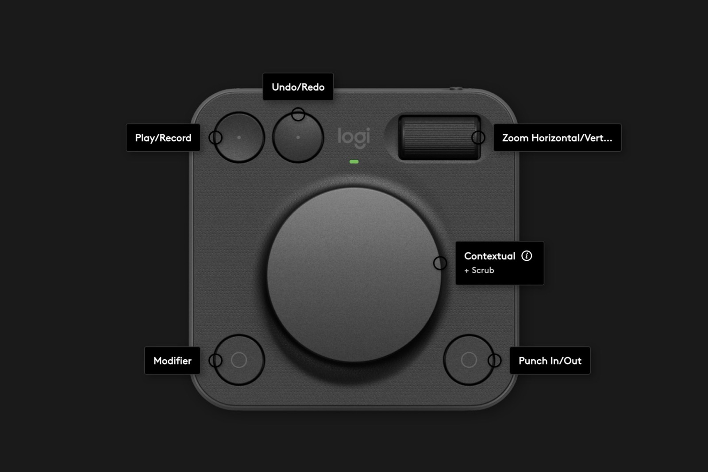

# Logic Pro plugin for Logitech MX Creative Console

An unofficial [Logi Actions SDK](https://logitech.github.io/actions-sdk-docs/) plugin that brings Logic Pro
controls to the MX Creative Console (and other Logi Plugin Service devices).

- **Dial** - scrub the timeline by bar, division, transient or audibly; zoom; select tracks; nudge regions.
- **Keypad** - transport, editing, track, view and project commands.
- **Modifier** - hold one button and every dial and key switches to a second action.
- The profile switches automatically when Logic Pro is the frontmost app.

Not affiliated with or endorsed by Apple or Logitech.

## Layout

Dialpad Default Profile



| Control | Normal | With Modifier held |
|---|---|---|
| Big dial | Scrub by Division | Scrub by Bar |
| Roller | Zoom Horizontal | Zoom Vertical |
| Upper-left dial | Play / Stop | Record |
| Upper-right dial | Undo | Redo |
| Lower-left button | **Modifier** - hold it | |
| Lower-right button | Set Punch In | Set Punch Out |

Hold the Modifier with a thumb and every other control on the pad takes its second action.

## How it works

Every action sends a Logic key command, but only when Logic Pro is the focused application - the plugin checks before
sending, so a dial still coasting after you switch apps cannot type into whatever is in front.

Keystrokes are paced, not queued: one per dial event, at least 25 ms apart. Logic takes real time to act
on each key, so sending them in bursts builds a backlog inside Logic and the playhead keeps moving after
the dial stops. The cost of pacing is that a hard spin travels no further than a slow one.

### Dial modes

| Mode | Turn left / right |
|---|---|
| Scrub by Bar | Rewind / Forward (`,` (comma) / `.` (period)) |
| Scrub Fast | Fast Rewind / Fast Forward (`Shift+,` / `Shift+.`) |
| Scrub by Transient | Rewind / Forward by Transient (`Control+,` / `Control+.`) |
| Scrub by Division \* | Rewind / Forward by Division Value |
| Scrub by Nudge Value \* | Rewind / Forward by Nudge Value |
| Audible Scrub \* | Scrub Rewind / Scrub Forward |
| Region Gain +/- 1 dB \* | Region Gain +1 dB / -1 dB |
| Region Gain +/- 0.1 dB \* | Region Gain +0.1 dB / -0.1 dB |
| Division Value \* | Set Next Lower / Higher Division |
| Prev / Next Marker | `Option+,` / `Option+.` |
| Zoom Horizontal | `Command+Left` / `Command+Right` |
| Zoom Vertical | `Command+Up` / `Command+Down` |
| Select Track | `Up` / `Down` arrows |
| Nudge Region | `Option+Left` / `Option+Right` |
| Undo / Redo | `Command+Z` / `Shift+Command+Z` |

## Logic key assignments

Twenty-seven Logic commands ship with **no key command at all**, so the plugin cannot reach them until one
is assigned. Actions that need one are marked with an asterisk - "Division 1/16 \*" - in the action list.

Merge the bundled [key command file](keycommands/logic-pro-mx-console.logikcs) to assign the actions below automatically, or set them manually.

| Logic command | Key | Used by |
|---|---|---|
| Rewind by Division Value | Ctrl+Opt+Cmd+Shift+4 | Scrub by Division, Rewind by Division |
| Forward by Division Value | Ctrl+Opt+Cmd+Shift+5 | Scrub by Division, Forward by Division |
| Rewind by Nudge Value | Ctrl+Opt+Cmd+Shift+6 | Scrub by Nudge Value |
| Forward by Nudge Value | Ctrl+Opt+Cmd+Shift+7 | Scrub by Nudge Value |
| Scrub Rewind | Ctrl+Opt+Cmd+Shift+8 | Audible Scrub |
| Scrub Forward | Ctrl+Opt+Cmd+Shift+9 | Audible Scrub |
| Region Gain +1 dB | Ctrl+Opt+Cmd+Shift+G | Region Gain dial |
| Region Gain -1 dB | Ctrl+Opt+Cmd+Shift+H | Region Gain dial |
| Region Gain +0.1 dB | Ctrl+Opt+Cmd+Shift+J | Region Gain (fine) dial |
| Region Gain -0.1 dB | Ctrl+Opt+Cmd+Shift+K | Region Gain (fine) dial |
| Set Next Higher Division | Ctrl+Opt+Cmd+Shift+Q | Division Finer, Division Value dial |
| Set Next Lower Division | Ctrl+Opt+Cmd+Shift+W | Division Coarser, Division Value dial |
| Set Division Value to 1/4 Note | Ctrl+Opt+Cmd+Shift+E | Division 1/4 |
| Set Division Value to 1/16 Note | Ctrl+Opt+Cmd+Shift+T | Division 1/16 |
| Set Division Value to 1/32 Triplet (1/48) | Ctrl+Opt+Cmd+Shift+S | Division 1/48 |
| Set Division Value to 1/128 Triplet (1/192) | Ctrl+Opt+Cmd+Shift+V | Division 1/192 |
| Snap Mode: Smart | Ctrl+Opt+Cmd+Shift+A | Snap: Smart |
| Snap Mode: Bar | Ctrl+Opt+Cmd+Shift+B | Snap: Bar |
| Snap Mode: Beat | Ctrl+Opt+Cmd+Shift+C | Snap: Beat |
| Snap Mode: Division | Ctrl+Opt+Cmd+Shift+D | Snap: Division |
| Snap Mode: Ticks | Ctrl+Opt+Cmd+Shift+F | Snap: Ticks |
| Toggle Low Latency Monitoring Mode | Ctrl+Opt+Cmd+Shift+L | Low Latency Mode |
| Play or Stop and Go to Last Locate Position | Ctrl+Opt+Cmd+Shift+M | Play / Stop & Return |
| Stop or Play From Last Position | Ctrl+Opt+Cmd+Shift+N | Stop / Resume |
| Remove Fades | Ctrl+Opt+Cmd+Shift+Z | Remove Fades |
| Show/Hide Tuner | Ctrl+Opt+Cmd+Shift+X | Show/Hide Tuner |
| Set Punch Locators by Regions/Events/Marquee | Ctrl+Opt+Cmd+Shift+P | Punch from Selection |

All twenty-seven sit on Control+Option+Command+Shift. That is every modifier at once, which nobody
would want to type - but nobody has to: the file below assigns them. It is the only modifier family
Logic's defaults leave essentially empty, so none of these collide with a Logic command in any window.

### Importing them

[`keycommands/logic-pro-mx-console.logikcs`](keycommands/logic-pro-mx-console.logikcs) defines exactly
these twenty-seven commands and nothing else.

1. In Logic, press Option+K to open Key Commands.
2. The `⋯` menu → **Merge Key Commands…** → choose the file.

**Merge**, not Import. Merge adds these assignments and leaves everything else alone - Logic's defaults
and your own customisations both survive, which was verified by initialising a key command set, merging
this file, and confirming the stock assignments were untouched. **Import** would replace your whole set.

Nothing in the plugin depends on the file - you can assign the twenty-seven by hand from the table
instead, or point individual actions at your own keys with **Custom Shortcut**.

Assign only the ones you want: every action without an asterisk works out of the box.

Logic's Scrub Rewind and Scrub Forward are momentary - they scrub while the key is held rather than
tapped - so Audible Scrub holds its key for 40 ms automatically. The dial's **Hold key for** setting
exists for pointing a **Custom shortcut** at some other momentary command.

## Build

Requirements: Logi Options+ and a .NET SDK matching the Logi Plugin Service runtime - .NET 10 as of
Plugin API 6.4.

```bash
dotnet tool install --global LogiPluginTool
cd src && dotnet build
```

`dotnet build` links the plugin into Logi Plugin Service and reloads it.

After many reloads the service can stop applying edits made to configured actions - the panel shows the
new settings while the plugin still receives the old ones. Restart Logi Plugin Service from the Options+
settings and it clears. This is a development artefact of hot reloading; a normally installed plugin is
loaded once.

Package for distribution:

```bash
cd src && dotnet build -c Release
logiplugintool pack ./bin/Release/ ./LogicPro_1_0.lplug4
logiplugintool verify ./LogicPro_1_0.lplug4
```

## Setup

1. **Logi Plugin Service** needs Accessibility permission (System Settings → Privacy & Security →
   Accessibility), or no key command can reach Logic.
2. In Options+, open the Keypad or Dialpad, choose the **Logic Pro** profile, and drag actions from
   **All Actions → Installed Plugins → Logic Pro**.

## FAQ

**Does this plugin require a specific keyboard layout?**
The plugin assumes the standard QWERTY English (US) layout and Logic's default key command set. Other
layouts may not trigger every command; the **Custom Shortcut** action and the dial's **Custom shortcut**
mode let you point any control at the keys your own set uses.

**I've installed the plugin, but some actions don't work.**
Most often the key command behind the action has been changed or cleared in Logic. Open Logic's Key
Commands window (Option+K), search for the command, and check the Key column. The `⋯` menu's **Initialize all
Key Commands** restores Logic's defaults - export your own set first if you have customisations worth
keeping. A few actions (Scrub by Division Value, by Nudge Value, Audible Scrub) ship unassigned in Logic
by design and need a one-time assignment, described above. Any action can also be pointed at a different
key with the **Custom Shortcut** action.

**I changed a Modifiable Button or Dial's settings and it still does the old thing.**
Restart Logi Plugin Service (Options+ settings → Restart Logi Plugin Service). The service keeps its own
copy of each configured action and can stop noticing edits after the plugin has been reloaded several
times, which happens during development and can happen once after a plugin update. A fresh service picks
up edits immediately.

**Does the plugin type into other applications?**
No. Every key command checks that Logic Pro is frontmost before sending, and is dropped otherwise.

**Does this plugin collect personal data?**
No. It sends key commands to Logic Pro on your own machine, and communicates with nothing else.

## License

MIT
